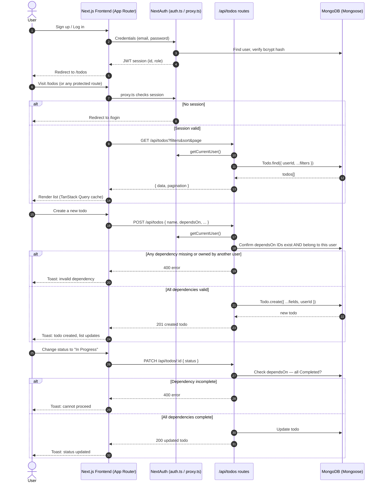
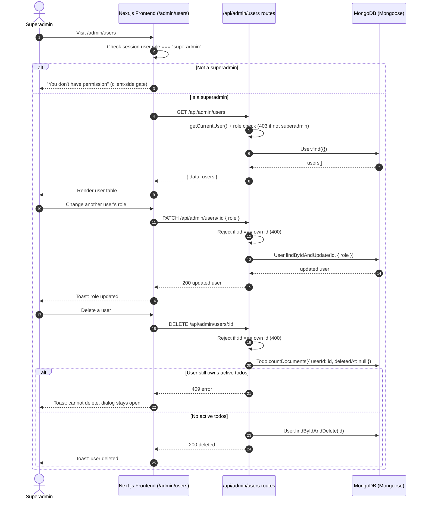

# TODO List App

A full-stack TODO list application built as part of the SleekFlow Software Engineer take-home project. Supports multi-user accounts, task dependencies, filtering/sorting, and role-based user management.

## 1. Run Locally

### Prerequisites

- Node.js 20+
- npm 10+
- A MongoDB Atlas cluster (free tier is fine)

### Steps

1. Install dependencies

```bash
npm install
```

2. Create `.env.local` in the project root

```bash
MONGODB_URI=your_mongodb_atlas_connection_string
AUTH_SECRET=generate_with_npx_auth_secret
```

Generate `AUTH_SECRET` with:

```bash
npx auth secret
```

3. MongoDB Atlas setup
   - Create a free cluster.
   - Create a database user (Database Access) and note the username/password.
   - Under Network Access, allow your current IP, or `0.0.0.0/0` for local development.
   - Copy the connection string from **Connect → Drivers**, insert your password, and add a database name before the `?` (e.g. `.../todo-app?retryWrites=true...`).

4. Start the app

```bash
npm run dev
```

5. Open the app
   - `http://localhost:3000/` — redirects to `/todos` if logged in, or `/login` if not
   - Sign up: `http://localhost:3000/signup`
   - Todos (protected): `http://localhost:3000/todos`

### Creating the first superadmin

There is no UI path to becoming a superadmin — this is intentional (see [Decisions & Trade-offs](#4-decisions--trade-offs)). After signing up normally, open MongoDB Atlas's Collections view, find your user document in the `users` collection, and manually change its `role` field from `"user"` to `"superadmin"`. Log out and back in for the new role to take effect in your session.

### Deployment

Deployed on Vercel. Both environment variables above must be set in the Vercel project's Environment Variables settings. MongoDB Atlas's Network Access must allow connections from anywhere (`0.0.0.0/0`), since Vercel's serverless functions don't have a fixed IP.

---

## 2. Documentation

### 2.1 High-Level Overview

Users can register, log in, and manage a personal TODO list: creating, editing, filtering, sorting, and deleting tasks. Tasks support priority, due dates, and dependencies on other tasks (a task can't be started or completed until its dependencies are done). A superadmin role can view all registered users and manage their roles.

### 2.2 Tech Stack

- **Framework:** Next.js (App Router, Route Handlers) — chosen so the API and UI live in a single repo/deployment, no separate backend project needed.
- **Language:** TypeScript, strict mode.
- **UI:** Tailwind CSS + shadcn/ui (Base UI primitives).
- **Data fetching:** TanStack Query — handles loading/error/caching state and cache invalidation after mutations, instead of hand-rolled `useState`/`useEffect` fetching.
- **Database:** MongoDB (Atlas) via Mongoose.
- **Auth:** NextAuth (Credentials provider, JWT sessions).

### 2.3 Data Model

#### Todo

| Field                     | Type                                                          | Notes                                          |
| ------------------------- | ------------------------------------------------------------- | ---------------------------------------------- |
| `userId`                  | ObjectId (ref: User)                                          | Owner. Every query is scoped to this.          |
| `name`                    | string, required                                              |                                                |
| `description`             | string                                                        | Optional.                                      |
| `dueDate`                 | Date                                                          | Optional.                                      |
| `status`                  | `"Not Started" \| "In Progress" \| "Completed" \| "Archived"` | Default `"Not Started"`.                       |
| `priority`                | `"Low" \| "Medium" \| "High"`                                 | Default `"Medium"`.                            |
| `dependsOn`               | ObjectId[] (ref: Todo)                                        | Prerequisites — one-directional (see §4).      |
| `recurrence`              | `{ frequency, intervalDays? }`                                | `frequency`: none/daily/weekly/monthly/custom. |
| `deletedAt`               | Date \| null                                                  | Soft delete marker.                            |
| `createdAt` / `updatedAt` | Date                                                          | Automatic timestamps.                          |

Indexes: compound indexes on `(userId, status)`, `(userId, priority)`, `(userId, dueDate)`, `(userId, deletedAt)` — every query filters by owner first, so single-field indexes alone would be far less useful.

#### User

| Field                     | Type                     | Notes                   |
| ------------------------- | ------------------------ | ----------------------- |
| `email`                   | string, unique           | Lowercased, trimmed.    |
| `hashedPassword`          | string                   | bcrypt, 10 salt rounds. |
| `role`                    | `"user" \| "superadmin"` | Default `"user"`.       |
| `createdAt` / `updatedAt` | Date                     | Automatic timestamps.   |

### 2.4 API Routes

All routes below (except signup and NextAuth's own routes) require a valid session; unauthenticated requests receive `401`. Every todo route additionally scopes reads and writes to the logged-in user's own `userId` — a request for another user's todo behaves identically to a request for a nonexistent one (`404`), not a `403`, so ownership is never confirmed or denied to an unauthorized caller.

#### Auth

- `POST /api/auth/signup` — creates a user (`role` always defaults to `"user"` server-side, regardless of what the request body contains).
- `GET/POST /api/auth/[...nextauth]` — handled by NextAuth (login, session, sign-out).

#### Todos

- `GET /api/todos` — list, with query params: `status`, `priority`, `dueDateStatus` (`overdue`/`upcoming`), `dependencyType` (`none`), `sort`, `order`, `page`, `limit` (capped at 100).
- `POST /api/todos` — create. Validates dependency IDs exist and belong to the caller.
- `GET /api/todos/:id` — single todo, with `dependsOn` populated (name/status/priority/dueDate) and a computed `dependents` array (todos that depend on this one).
- `PATCH /api/todos/:id` — update. Enforces the dependency-completion rule and cycle detection (see §4).
- `DELETE /api/todos/:id` — soft delete. Blocked (`409`) if other todos still depend on this one.

#### Admin (superadmin only — `403` otherwise)

- `GET /api/admin/users` — list all users.
- `PATCH /api/admin/users/:id` — change a user's role. Blocked if targeting yourself.
- `DELETE /api/admin/users/:id` — delete a user. Blocked if targeting yourself, or if the user still owns any non-deleted todo.

### 2.5 Architecture



**Superadmin user-management flow:**



### 2.6 AI Usage Disclosure

- This project was built with assistance from Claude (Anthropic), used as a planning and pair-programming assistant throughout.
- Scope decisions, prioritization (core features before nice-to-haves), and interpretation of ambiguous requirements were made by me, based on the assignment brief and my own judgment — including the calls to defer full recurrence chaining, keep the list endpoint lean, and block deletions that have dependents for superadmin.

### 2.7 Features

- Email/password signup and login (bcrypt-hashed, JWT session via NextAuth).
- Full CRUD for todos: name, description, due date, status, priority.
- Filtering by status, priority, due-date status (overdue / not yet due), and dependency type (has none / any).
- Sorting by name, status, priority, due date, or creation time — three-state toggle (ascending → descending → off) with a persistent icon indicating sortability.
- Pagination with a configurable page size (10/25/50/100).
- Task dependencies: a task cannot move to "In Progress" or "Completed" until everything it depends on is "Completed." Circular dependencies are rejected on update.
- Soft delete — deleted todos are hidden, not destroyed. Deletion is blocked if other todos still depend on the one being deleted.
- Detail page per todo showing its dependencies and dependents with their live status, inline status changes, edit, and delete.
- Per-user data isolation — every user sees only their own todos, enforced server-side.
- Superadmin role: view all registered users, promote/demote roles, delete users (blocked from deleting self or a user who still owns active todos).
- Toast notifications for the outcome of every create/update/delete/status-change action; inline validation messages for form-level input errors.

### 2.8 Decisions & Trade-offs

This section is the project's decision log, covering ambiguous requirements, architectural choices, and what was deliberately left out.

**Requirement interpretation**

- _"A dependent task cannot be moved to In Progress until dependencies are Completed"_ — the spec only names "In Progress," but we extended the same rule to "Completed," reasoning that a task shouldn't be markable as done before its prerequisites are. "Archived" is left unrestricted, since archiving represents shelving/cancelling a task rather than finishing it.
- Past-due-date validation applies only at **creation**, not on edit — an already-overdue task must remain fully editable (including being marked complete), or normal use of the app would break the moment a due date passes.
- Recurring todo that also has dependents raises the question of whether new occurrences should be linked together across the whole chain and is genuinely complex (see below), so recurrence and dependencies are kept as 2 separated features.
- `dependsOn` is stored one-directional (only the "depends on" side). The reverse relationship ("what depends on me") is computed via query when needed (on the detail page, and for the delete-guard), rather than stored on both sides — this avoids the two references ever falling out of sync with each other.

**Architectural decisions**

- Soft delete (`deletedAt` marker) instead of hard delete, satisfying "data should not be permanently lost."
- Circular-dependency detection only runs meaningfully on **update**, not create — a brand-new todo has no ID yet, so nothing can already reference it; a naive implementation that ran the same check on create would be dead code that never fires.
- Deleting a todo that other (non-deleted) todos depend on is **blocked** (`409`), not cascaded. Cascading would mean either silently stripping references from unrelated todos or silently deleting them too — both risk surprising data loss. The user must resolve the dependency explicitly first.
- The list endpoint deliberately does **not** populate dependency status for every row (to avoid an expensive join-like lookup on every page load); the detail endpoint does, since it's a single-document fetch. As a result, a true "blocked/unblocked" indicator is only available on the detail page, though a "has no dependencies" filter is available on the list.
- Deleting a user is blocked if they still own any active (non-deleted) todo, regardless of that todo's status — this includes Completed todos, treated as historical data still worth a deliberate decision before removal. This is a conservative default, and is easy to relax later (e.g. exempting Completed/Archived todos) if that turns out to be unnecessarily strict; the reverse — loosening a check that was actually needed — is a worse failure mode.
- Pagination (max page size 100, server-enforced regardless of client input) plus compound indexes on `(userId, <filter field>)` address the "10,000+ items" non-functional requirement without needing to actually provision or test against a 10k-row dataset.
- JWT session strategy (not database-backed sessions) — no extra collection needed; the trade-off (can't forcibly invalidate a single session server-side without extra infrastructure) doesn't matter at this project's scale.

**What was chosen NOT to build, and why**

- **Recurrence with dependency chains.** A recurring todo that has dependents would need, on completion, to regenerate not just itself but the whole downstream chain — with each new occurrence correctly re-linked to the new occurrence of its dependency, not the old completed one. This is a real graph-cloning problem (potentially unbounded depth and branching), not a small feature. Attempting a one-level version felt like it would half-solve the problem while still costing significant time.
- **Reassigning a user's todos to someone else.** Since user deletion is blocked while a user owns active todos, an obvious next step is letting a superadmin reassign those todos to another user before deleting the original owner. Not built, but the current blocking behavior deliberately leaves room for this to be added later without needing to redesign the deletion flow.
- **Superadmin "view all todos" page.** Superadmins currently manage users but see only their own todo list, same as any other user — an admin-facing view across all users' todos was not built.
- **Automated tests.** Skipped,
- **Docker / CI-CD.** Not built.
- **Real-time updates, bulk operations.** Not built

### 2.9 Assumptions

- A todo with no due date is treated as "not overdue" for the purposes of the due-date filter — there's nothing for it to have missed.
- Roles are limited to `user` and `superadmin`; there is no in-between tier.
- The very first superadmin is created by manually editing the database — there is intentionally no self-service path to becoming an admin.

### 2.10 Testing Approach

Automated tests were not written for this submission, given the time constraints and the number of core/required features prioritized instead (dependency logic, auth, per-user scoping, role management). All functionality below was verified manually.

**Manual UAT**

| #   | Scenario                                                                          | Expected result                                                         | Pass? |
| --- | --------------------------------------------------------------------------------- | ----------------------------------------------------------------------- | ----- |
| 1   | Sign up new user                                                                  | Account created, logged in, redirected to `/todos`                      | ✅    |
| 2   | Sign up with an already-registered email                                          | `409` error, no duplicate account created                               | ✅    |
| 3   | Sign up with a password under 8 characters                                        | Validation error, no account created                                    | ✅    |
| 4   | Log in with correct credentials                                                   | Redirected to `/todos`                                                  | ✅    |
| 5   | Log in with wrong password                                                        | Error toast, stays on login page                                        | ✅    |
| 6   | Visit `/todos` while logged out                                                   | Redirected to `/login`                                                  | ✅    |
| 7   | Create a todo (all fields)                                                        | Appears in list, correct values                                         | ✅    |
| 8   | Create a todo with an empty name                                                  | Inline validation error, not submitted                                  | ✅    |
| 9   | Create a todo with a past due date                                                | Blocked with a validation error                                         | ✅    |
| 10  | Edit an already-overdue todo (change only priority)                               | Saves successfully — past-due check does not block edits                | ✅    |
| 11  | Filter list by status / priority / due-date status / dependency type              | List narrows correctly; filters combine (AND)                           | ✅    |
| 12  | Sort by each column                                                               | Cycles ascending → descending → off; only one active column at a time   | ✅    |
| 13  | Change page size / paginate                                                       | Row count and page count update correctly                               | ✅    |
| 14  | Set task B to depend on task A; try moving B to In Progress before A is Completed | Blocked with an error                                                   | ✅    |
| 15  | Complete A, then retry moving B to In Progress                                    | Succeeds                                                                | ✅    |
| 16  | Attempt to make A depend on B (after B already depends on A)                      | Rejected — circular dependency                                          | ✅    |
| 17  | Delete a todo that another todo depends on                                        | Blocked (`409`), error toast, confirmation dialog stays open            | ✅    |
| 18  | Remove the dependency, then delete                                                | Succeeds                                                                | ✅    |
| 19  | Log in as a second user                                                           | Sees an empty/different todo list — no access to the first user's todos | ✅    |
| 20  | Attempt to load another user's todo detail page by ID directly                    | `404`, not `403` or a data leak                                         | ✅    |
| 21  | Log in as superadmin, visit `/admin/users`                                        | User list loads; regular users cannot access this page                  | ✅    |
| 22  | Change another user's role                                                        | Succeeds, reflected immediately                                         | ✅    |
| 23  | Attempt to change your own role or delete your own account                        | Blocked                                                                 | ✅    |
| 24  | Attempt to delete a user who still owns an active todo                            | Blocked (`409`)                                                         | ✅    |

## 3. If I Had More Time

- **Recurrence with dependency chains** — the single largest deferred feature (see §2.8). Would design a way to link recreated occurrences across a whole dependency chain (e.g. a shared "recurrence group" identifier) rather than treating each recurring todo in isolation.
- **Automated tests** — unit tests for the dependency-graph logic (cycle detection, completion checks) and the recurrence date math first, since these are the most logically intricate and error-prone pieces; integration tests for the auth/ownership-scoping boundary second, since that's the most security-sensitive area.
- **A correct "blocked/unblocked" indicator on the list view**, computed server-side, rather than only being visible on the detail page.
- **Todo reassignment** when deleting a user, so a superadmin isn't stuck if a user with active todos needs to be removed.
- **Docker / docker-compose** for one-command setup, removing the manual MongoDB Atlas configuration step.
- **Rate limiting** on auth endpoints (login, signup) to reduce brute-force risk.
